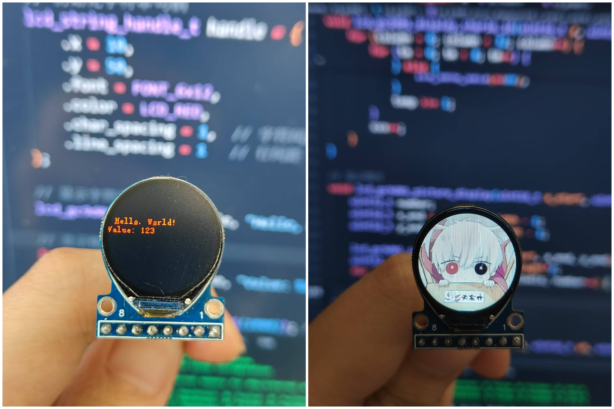

# ESP32 LCD GC9D01 驱动

## 介绍
本项目是一个基于 ESP32 IDF框架的 LCD GC9D01 显示屏驱动库。GC9D01 是一款常见的 SPI 接口的 LCD 显示屏控制器，常用于淘宝上的小型LCD屏幕（小于1英寸），GC9D01 支持 RGB565 格式的颜色显示。

本项目提供了基本的图形绘制功能，如绘制像素点、线条、矩形、圆形、三角形等，并支持显示中英文字符和图片。



要将组件添加到项目中请在IDF终端执行下方命令:

```cpp
idf.py add-dependency "ningzixi/lcd_gc9d01^1.0.0"
```
或者直接克隆本仓库到项目`components`目录下:

```cpp
git clone https://github.com/NingZiXi/lcd_gc9d01.git
```
## 使用示例

在**menuconfig**或**lcd_gc9d01.h** 文件中，用户可以根据实际硬件连接配置引脚和屏幕参数

```
    lcd_gc9d01_init(); // 初始化 GC9D01
    lcd_gc9d01_clear(); // 清屏
    
    // 1.初始化字符串句柄
    lcd_string_handle_t lcd_string_handle = {
        .x = 10,
        .y = 50,
        .font = FONT_6x12,  //FONT_6x12 FONT_8x16  FONT_11x17 FONT_13x22 FONT_16x26
        .color = LCD_RED,
        .char_spacing = 1,  // 字符间距
        .line_spacing = 1   // 行间距
    };
    
    //lcd_string_handle_t lcd_string_handle=LCD_STRING_HANDLE_DEFAULT(10, 70); // 或者使用默认宏初始化字符串句柄

    // 2.显示字符串
    lcd_gc9d01_printf(&lcd_string_handle, "Hello, World!\n");

    int value = 123;
    lcd_gc9d01_printf(&lcd_string_handle, "Value: %d", value);     // 显示格式化字符串

```
更多API接口请查看[lcd_gc9d01.h](include/lcd_gc9d01.h)

## 贡献
本项目采用 **MIT** 许可证，详情请参阅 [LICENSE](LICENSE) 文件。

**注意**: 本项目仍在完善中，可能会有一些功能尚未完善或存在 Bug。如果您在使用过程中遇到任何问题，请随时联系作者或提交 Issue 来帮助改进本项目！感谢所有贡献者以及开源社区的支持！

